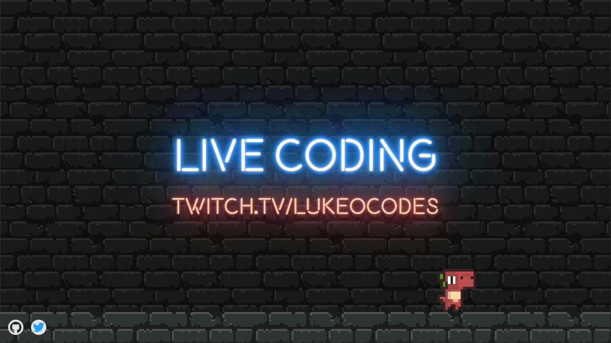

# Hello, folks!

I'm Luke, and I am a Developer Experience Engineer. You can find me on [Twitter][1], or on [Twitch][2]. 

Developer Relations (and Developer Experience specifically) is about smoothing out the experience between a developer (you) and a product (my employer). This may involve developing cool cools like CLIs, creating great content, hands on or recorded teaching, building platforms, or developing APIs and SDKs for developers to use.

## 🔧 Technologies & tools ...

<!-- links to your social media accounts -->

[1]: https://twitter.com/lukeocodes
[2]: https://twitch.tv/lukeocodes
