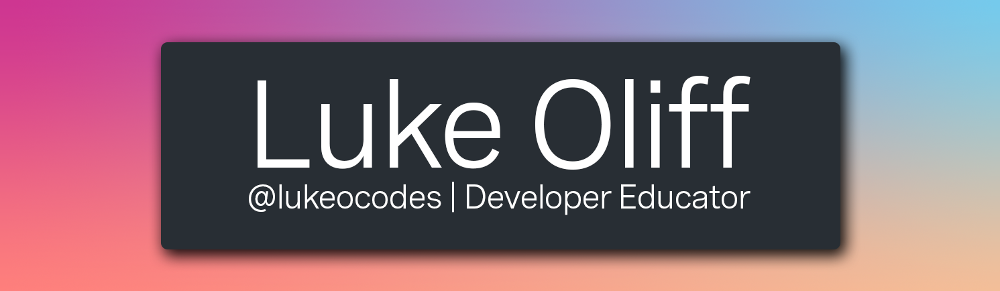

<!-- More info, tips and tricks for making GitHub Profile README can be found in my article at https://towardsdatascience.com/build-a-stunning-readme-for-your-github-profile-9b80434fe5d7 -->

# Hello, folks! 

I'm Luke, a Developer Educator working for Vonage in the Product Team, from the UK. You can find me on [![Twitter][1.2]][1],  or on [![LinkedIn][2.2]][2].

## 🔭 I’m currently working on ...

- Lots of content for Vonage
- This [little Pokémon themed chat](https://github.com/Team-PokeChat/pok--chat) app

## 🔧 Technologies & tools ...

## 🤔 I’m looking for help with ...

- This [little Pokémon themed chat](https://github.com/Team-PokeChat/pok--chat) app

## 💬 Ask me about ...

- Inclusive Language
- The benefits of Jamstack

## 📈 GitHub stats ...

<!-- icons without padding -->

[1.2]: twitter-3-16.png (twitter icon without padding)
[2.2]: linkedin-3-16.png (LinkedIn icon without padding)

<!-- links to your social media accounts -->

[1]: https://twitter.com/lukeocodes
[2]: https://www.linkedin.com/in/lukeocodes

<!-- Resources -->
<!-- Icons: https://simpleicons.org/ -->
<!-- GitHub Stats: https://github.com/anuraghazra/github-readme-stats -->
<!-- Emojis: https://emojipedia.org/emoji/ -->
<!-- HTML Emojis: https://www.fileformat.info/index.htm -->
<!-- Shields: https://shields.io/ -->
<!-- Awesome GitHub Profile README: https://github.com/abhisheknaiidu/awesome-github-profile-readme -->
